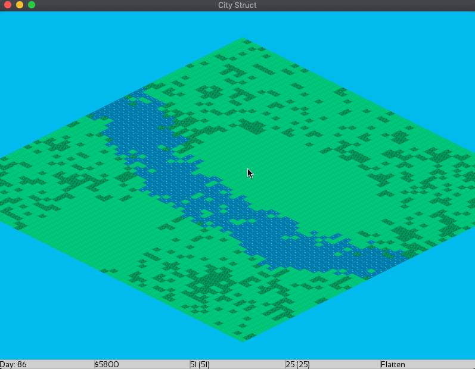

# City Struct

A city builder, made out of love of SimCity 2000, using C++11 and SFML 

### Features:
* pixel graphics
* load and save games
* Ability to construct residental, commerical and industrial zones
* live population 
